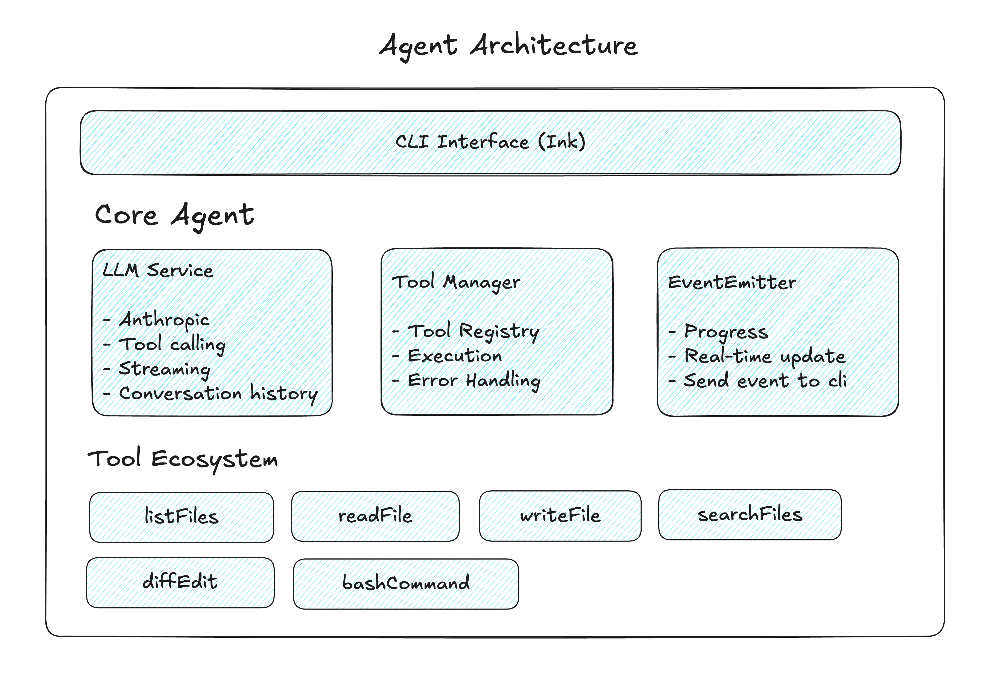

# NextJS Database Agent

A database agent that produces code for NextJS applications. This agent generates:

- **Database Schema**: SQLite database schemas using Drizzle ORM
- **Migrations**: Database migrations managed by Drizzle Kit
- **API Routes**: NextJS API endpoints for data operations
- **React Hooks**: Custom hooks for data fetching and state management
- **Sample Data**: Seeders to populate the database with sample data

**Notes**: 
- The agent system prompt is tuned specifically for the Claude Sonnet 4 model (claude-sonnet-4-20250514). 
- It typically completes one full implementation in 4-8 minutes, with costs ranging from $1.5-$2 per complete workflow implementation.

## How to test?

Setup the `.env`

```
ANTHROPIC_API_KEY=
ANTHROPIC_MODEL=claude-sonnet-4-20250514
```

Install the dependencies
```bash
npm install
```

Run the dev server, we need this because agent will run some test for the api it creates.

```bash
npm run dev
```

**Start the agent**

There are two way to start the agent:

1. Start with prompt

```bash
npm run agent "your prompt here"
```

2. Use interactive terminal

```bash
npm run agent
```

## Agent Architecture

Read [database-agent.md](./docs/database-agent.md) for detailed information about the architecture, design decisions, and implementation strategies behind this agent.



Terimanl Rendering flow


