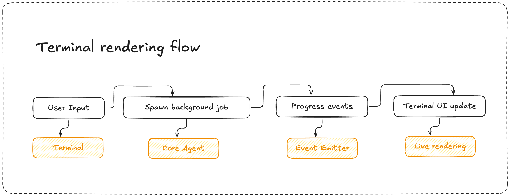

# Database Agent Design Document

## Agent Description
A modular database agent with core functionality that can be consumed via CLI interface or API service, automatically implementing database features based on natural language queries.

## Features
### Core Agent
- **Natural Language Processing**: Interprets user queries like "store recently played songs in a table"
- **Code Analysis**: Scans existing Next.js components to understand integration points
- **Database Operations**: Creates schemas, migrations, API routes, and frontend integrations
- **Progress Events**: Emits real-time progress updates for any interface to consume

### CLI Interface
- **Interactive Terminal**: Persistent input box with scrollable output history
- **Real-time Progress Display**: Shows agent thinking process, file operations, and current status
- **Command Structure**: Supports various commands and options


**Reasoning**: Modular design allows the core agent to be reused across different interfaces while maintaining focused functionality. **Tradeoff**: Added complexity in architecture but better extensibility and reusability.

## Package Selection
- **ink**: Rich terminal UI with layout management for split-screen interface
- **commander.js**: Command-line argument parsing and command structure
- **chalk**: Terminal colors and styling for better UX
- **eventemitter3**: High-performance event emitter for reactive pub/sub architecture
- **drizzle-orm**: TypeScript ORM for database operations as recommended
- **execa**: Process execution for running migrations and commands
- **fs-extra**: Enhanced file system operations for code generation

**Reasoning**: Proven packages that handle specific concerns well. EventEmitter3 chosen for optimal performance in real-time progress updates. **Tradeoff**: More dependencies but better maintainability and reliability than building from scratch.

## Folder Structure
```
├── agent/
│   ├── cli/
│   │   └── AgentCLI.tsx          # CLI interface components
│   ├── core/
│   │   ├── CoreAgent.ts          # Core agent logic (interface-agnostic)
│   │   ├── diff-edits/           # Advanced file editing utilities
│   │   │   ├── README.md
│   │   │   └── diff-apply.ts
│   │   ├── llm.ts                # LLM service integration
│   │   └── tools/                # Tool ecosystem
│   │       ├── bashCommand.ts
│   │       ├── diffEdit.ts
│   │       ├── index.ts
│   │       ├── listFiles.ts
│   │       ├── readFile.ts
│   │       ├── searchFiles.ts
│   │       └── writeFile.ts
│   ├── prompts/
│   │   └── systemPrompt.ts       # System prompts and instructions
│   ├── types/
│   │   ├── index.ts              # Type definitions
│   │   ├── tools.ts
│   │   └── types.ts
│   └── utils/
│       ├── index.ts              # Utility functions
│       └── logger.ts             # Logging utilities
```

## Architecture

### Agent Core Architecture

The agent follows a layered architecture with three main components:

```
┌─────────────────────────────────────────────────────────────┐
│                     CLI Interface                           │
├─────────────────────────────────────────────────────────────┤
│                     CoreAgent                               │
│  ┌─────────────────┐  ┌─────────────────┐  ┌─────────────┐  │
│  │   LLMService    │  │   ToolManager   │  │ EventEmitter│  │
│  │                 │  │                 │  │             │  │
│  │ • Anthropic API │  │ • Tool Registry │  │ • Progress  │  │
│  │ • Tool Calling  │  │ • Execution     │  │ • Real-time │  │
│  │ • Streaming     │  │ • Error Handle  │  │ • Updates   │  │
│  │ • Conversation  │  │                 │  │             │  │
│  └─────────────────┘  └─────────────────┘  └─────────────┘  │
├─────────────────────────────────────────────────────────────┤
│                     Tool Ecosystem                          │
│  listFiles | readFile | writeFile | bashCommand | searchFiles | diffEdit │
└─────────────────────────────────────────────────────────────┘
```

### Component Responsibilities

**CoreAgent** (`agent/core/CoreAgent.ts:8`)
- Main orchestrator that coordinates LLM and tools
- Manages conversation state and processing lifecycle
- Emits progress events for UI consumption
- Handles abort signals and error propagation

**LLMService** (`agent/core/llm.ts:6`)
- Anthropic API integration with streaming support
- Tool calling coordination and response handling
- Conversation history management with 20-message limit
- Thinking mode integration for transparent reasoning

**ToolManager** (`agent/core/tools/index.ts:10`)
- Tool registration and execution orchestration
- Error handling and result formatting
- Claude API tool schema generation
- Available tools: `listFiles`, `readFile`, `writeFile`, `bashCommand`, `searchFiles`, `diffEdit`
- **diffEdit**: Advanced file editing using SEARCH/REPLACE blocks for precise modifications without rewriting entire files

### Terminal rendering - Reactive Pub/Sub Flow




### Event-Driven Progress Flow

```
User Query → CoreAgent.processQuery() → Progress Events → CLI Rendering

Events Emitted:
├── thinking               # LLM reasoning process (streaming)
├── thinking_complete      # Thinking output finalized
├── analyzing             # Database requirements analysis  
├── executing_tools       # Tool execution notifications
├── tool_execution_complete # Tool completed successfully
├── tool_execution_error  # Tool execution failed
├── generating            # Final response generation
├── plan                  # Implementation plan output
├── complete              # Query processed successfully
├── error                 # General error states
└── aborted               # Operation cancelled by user
```

### Agent Loop Logic

The agent follows a sophisticated multi-turn conversation loop with tool execution:

```
1. Initial Request
   ├── User Query → Build Messages → Add to Conversation History
   └── Include System Prompt + Tools + Thinking Mode

2. LLM Processing (Streaming)
   ├── Thinking Phase: Stream reasoning process to UI
   ├── Tool Decision: Determine if tools are needed
   └── Response Generation: Stream text or tool calls

3. Tool Execution Phase (if tools requested)
   ├── Parse Tool Calls from LLM response
   ├── Execute Tools Sequentially with abort signal support
   ├── Collect Tool Results
   └── Add Tool Results to Conversation History

4. Recursive Loop (if more tools needed)
   ├── Send Tool Results back to LLM
   ├── LLM processes results and may request more tools
   ├── Continue until LLM provides final text response
   └── Handle up to N (20 max) tool cycles (prevents infinite loops)

5. Final Response
   ├── Extract final text response
   ├── Update complete conversation history
   └── Return response to user
```

**Key Features:**
- **Thinking Mode**: Transparent reasoning with 4096 token budget
- **Streaming**: Real-time progress updates during thinking and tool execution
- **Recursive Tool Calls**: Agent can use tools, analyze results, then use more tools
- **Conversation Memory**: Maintains 20-message rolling history
- **Prompt Caching**: System prompt and top 3 tools cached for performance
- **Abort Support**: All operations can be cancelled mid-execution

**Reasoning**: Core agent logic separated from interface layers enables reusability across CLI and API. **Tradeoff**: More nested structure but cleaner separation of concerns and easier testing.

Test Queries:
1. “Can you store the recently played songs in a table”
  The agent should create the table, populate it, and also create a route to fetch information from that table. 
  BONUS: integrate the route into the existing code so that the site actually fetches the data and properly displays it on the frontend.

2. “Can you store the ‘Made for you’ and ‘Popular albums’ in a table”
  The agent should create the tables, populate them, and also create a route to fetch information from those tables.
  BONUS: integrate the route into the existing code so that the site actually fetches the data and properly displays it on the frontend.
